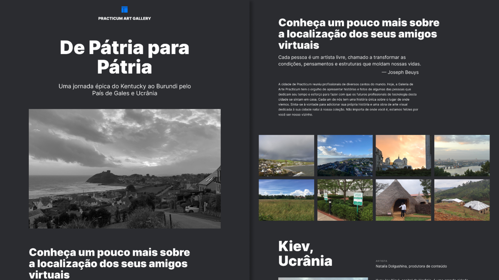

# Homeland - Tripleten

Bootcamp de Desenvolvimento Web - TripleTen

  

- <a href="https://danniela-91.github.io/web_project_homeland/" target="_blank">Veja o projeto completo</a>

## 🚀 Tecnologias

Esse projeto foi desenvolvido com as seguintes tecnologias:

- HTML5
- CSS
- Git e Github
- Metodologia BEM
- Responsividade

## 💻 Projeto

Nesse projeto da sprint 4, foi proposto criar uma página web que mostra as cidades natais de alguns funcionários do TripleTen, com um toque pessoal.

## 🛠 Melhorias

Algumas melhorias que podem ser aplicadas:

- Deixar a página mais dinâmica e interativa com animações em alguns elementos
- Criar um menu de navegação com Links âncora de rolagem suave

---

Feito com ♥ by Daniela Tenório
